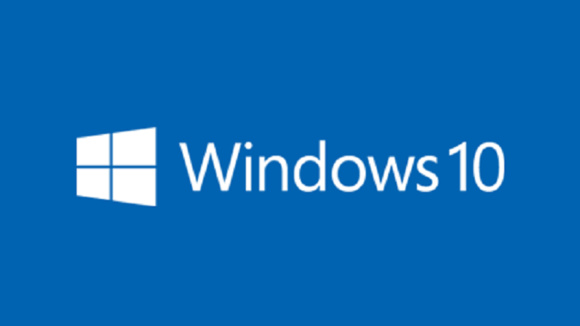
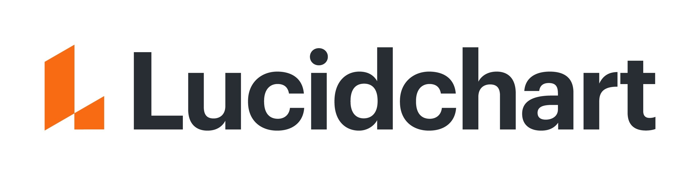

### Hi there 👋

- 🔭 I’m currently working on using Postgres SQL and Python in building a diverse assets portfolio of stock and cryptocurrencies.   

- 🌱 I’m currently learning about how to use Python to build various algorithmic trading strategies.  

- 👯 I’m looking to collaborate on anything that involves using Python to create solutions for finance.   

- 💬 Ask me about: 
           How to get started with Python for finance. 
           Investing in listed and unlisted companies. 
           Accounting and Finance. 

- 📫 Feel free to connect and reach out:  

<h3 align="left">System:</h3>

 
    

<h3 align="left">Languages:</h3>

 
     

<h3 align="left">Tools:</h3>

     
     
    
    <a href="https://www.lucidchart.com/pages/integrations/github?utm_source=google&utm_medium=cpc&utm_campaign=_en_tier1_mixed_search_brand_bmm_&km_CPC_CampaignId=1490375424&km_CPC_AdGroupID=106141745441&km_CPC_Keyword=%2Blucidchart%20%2Bgithub&km_CPC_MatchType=b&km_CPC_ExtensionID=&km_CPC_Network=g&km_CPC_AdPosition=&km_CPC_Creative=441665757045&km_CPC_TargetID=kwd-938876739594&km_CPC_Country=9046884&km_CPC_Device=c&km_CPC_placement=&km_CPC_target=&mkwid=s6MpoMVum_pcrid_441665757045_pkw_%2Blucidchart%20%2Bgithub_pmt_b_pdv_c_slid__pgrid_106141745441_ptaid_kwd-938876739594_&gclid=CjwKCAjwvMqDBhB8EiwA2iSmPHvTiTlsluYAIVY5OeGc_SnbSNac6pQiSUXG-Mj5ZpJ3u_nnRakEYRoC1F8QAvD_BwE" target="_blank">  </a>
            
         
        
        

<h3 align="left">Stats:</h3>

<!--
**IrinaMaria/IrinaMaria** is a ✨ _special_ ✨ repository because its `README.md` (this file) appears on your GitHub profile.

Here are some ideas to get you started:

- 🤔 I’m looking for help with ...
- 💬 Ask me about ...
- 😄 Pronouns: ...
- ⚡ Fun fact: ...
-->
